**Install Instructions** 
- Clone the repository at a location of your choice. 
- Make sure to have Python & Django installed. 
- All extra requirements are placed in the [text](requirements.txt) file. 
- Install the requirements from the terminal space into the project folder. 
- For any Linux Shared Hosting Server, make sure that Whitenoise is installed and placed in the Middleware to serve static files, otherwise styles will not be applied. 
- JSON is used as the database for this app but I personally would recommend NoSQL. 

**Unit Test Information** 
- All tests performed on the code are placed in the tests.py file. 
- Basic testing is done using the built-in function and TestCase classes. 

Screenshots

Login:

Initially each user not logged in will be redirected to the login page as all functionalities are accessible to only logged-in users.

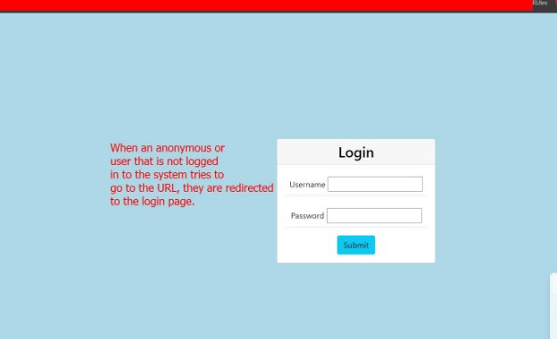

***Fig:** 1 Login*

***Fig:** 1.1 Redirect After Successful Login*

CRUD Operations:

Creating A Record:

A form exists to add data to the record. It validates the data on both the client’s side (using jQuery & JS) and Django’s built-in server-side validation. Clicking the add event button on the navbar will lead to this page.

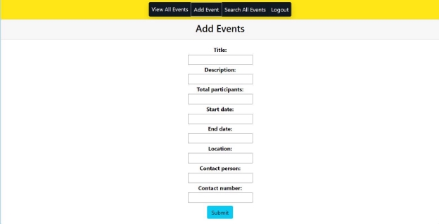

***Fig:** 2 Event Add Form*

Dates use the ‘datepicker’ widget provided by jQuery and JS instead of Django because Django’s datepicker uses localization settings and making the date format uniform is difficult. Also, the **End Date,** is always validated after the selection of the start date and must be less than the **Start Date.**

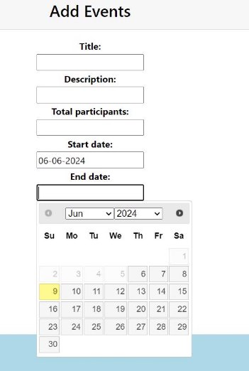

***Fig:** 2.1 Date Validation (client-side)*

Similarly, Total participants and contact number are integer fields, they will only accept numeric values using the **RegexValidator** functionality of Django/Python.

***Fig:** 2.2 Integer fields Validation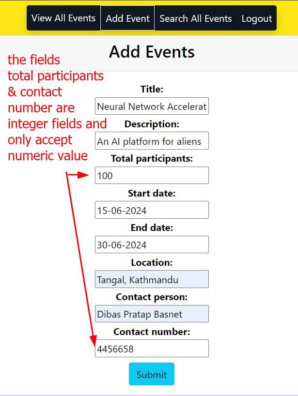*

The contact number must be more than 7 digits (999999), otherwise, the JS function intervenes with the form submission and alerts the user that the number is not valid.

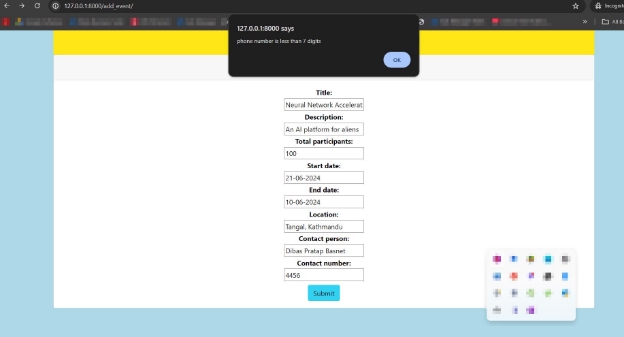

***Fig:** 2.2.1 Integer fields Validation*

Clicking/tapping the submit button if the form is valid will lead to a page with a basic bootstrap toast that alerts the user what event was added.

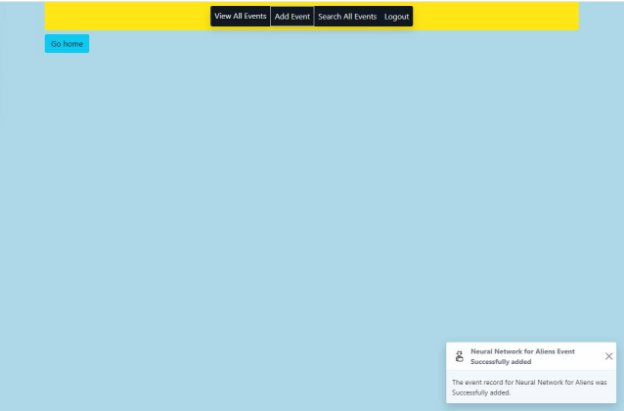

***Fig:** 2.3 Record Adding Success*

Reading Records:

Every record is read from the JSON file and is presented in a table. I chose *datatables* because they are simple to implement and give a lot of functionality.

Filtering:

We can filter each record by its title, start date, or end date. There are many ways to do this in my app. The first is the built-in search function of the datatables, but it is limited to the record shown on the page i.e. it has to be on the current page. Another way is clicking on the link inside the cell and wrapping the text as seen in ***Fig:** 2.4 Reading & Displaying Records.*

The variable for filtering (title, start date, or end date) depends on what is clicked. As said before, this is also limited to the records on the page. So we implement a search function to search records in the whole JSON file (in this case used instead of the database). Items can be deleted or edited from the display page.

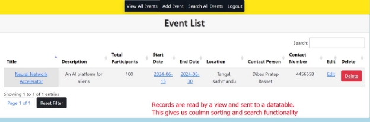

***Fig:** 2.4 Reading & Displaying Records*

Searching:

Like filtering, there are 3 ways to search records by, title, start date, & end date. Anyone can be chosen to filter records.

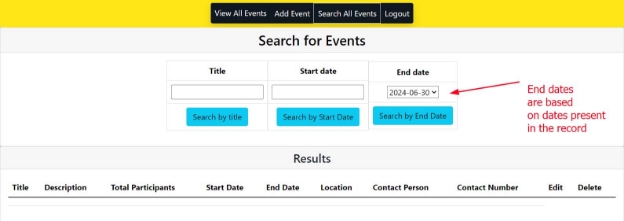

***Fig:** 2.4 Search function*

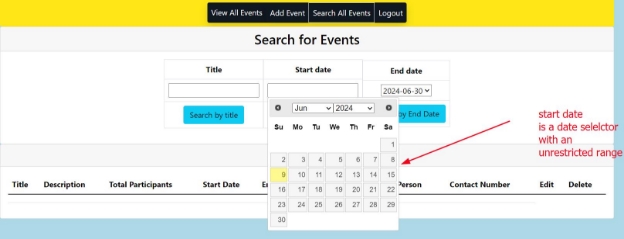

***Fig:** 2.4.1 Search function with datepicker*

*Records can be edited and deleted from search too. More on this later.*

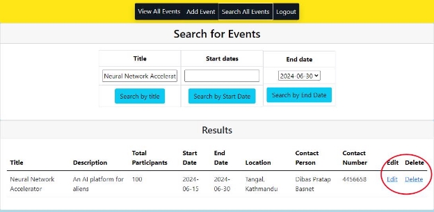

***Fig:** 2.4.2 Records can be edited or deleted by searching*

Updating:

We can also update the records using the edit button. This button allows us to update the record. In this app, the database is a JSON file so we cannot update it by conventional database techniques or DJango’ ORM, rather, we will remove the record by reading the file and then writing a new record to it with the updated details. Not that the ‘id’ field cannot be edited this way. Ids are assigned automatically based on the records present in the database.

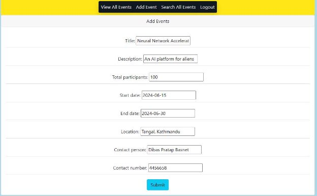

***Fig:** 2.5 Editing an event (Update function)*

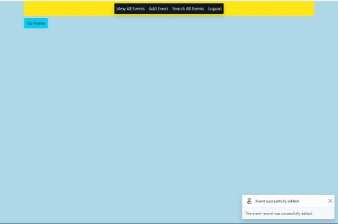

***Fig:** 2.5.1 Successfully editing a record*

Deleting:

The final of the CRUD operations is done in an interesting way because the data is stored in a JSON file. The file is read and the record with the id is removed by writing all the other records into a temporary file, then replacing the data inside the original file’s data.

Items can be deleted either from the display page or by searching for the record.

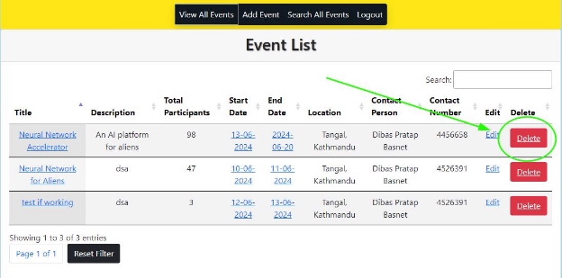

***Fig:** 2.6 Deleting records from display page*

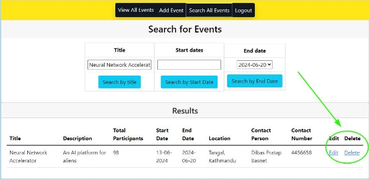

***Fig:** 2.6.1 Deleting records from search page*

***Fig:** 2.6.2 Successfully deleting a record*

Download:

After implementing all the CRUD functionalities, a download button was placed in the header to download all event items as a CSV file. The database, which in this case is a JSON file, was converted to a CSV file and can be downloaded.

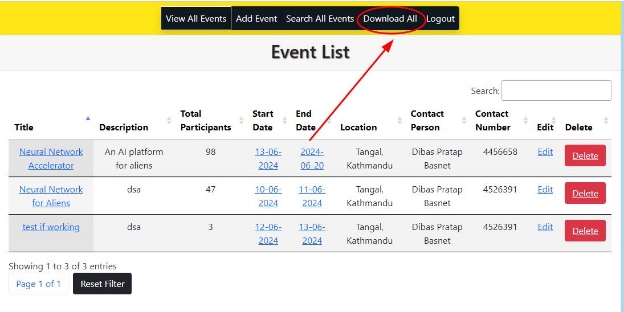

***Fig:** 2.7.1 Download Button for All Events*

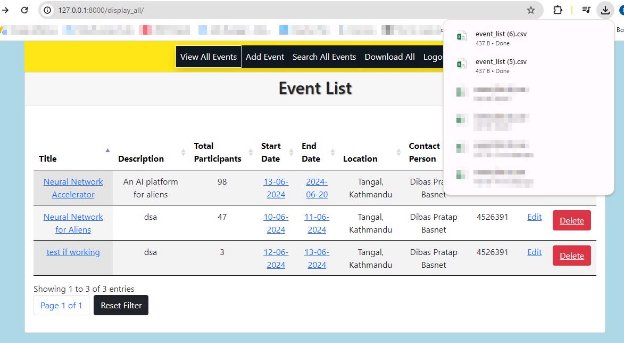

***Fig:** 2.7.2 Event List as a CSV file*

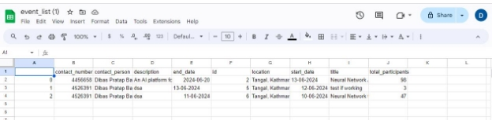

***Fig:** 2.7.3 The CSV file containing records*
